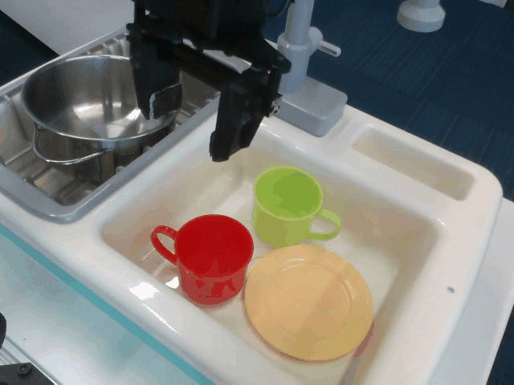

# Universal Actions for Enhanced Embodied Foundation Models

[[Project Page](https://2toinf.github.io/UniAct/)] [[Paper](https://arxiv.org/abs/2501.10105)]


<figure>




</figure>

<figure>


</figure>

<figure>


</figure>

📆 TODO

- [X] Release training codebase.
- [ ] Release training guidance.
- [ ] Release model checkpoints.
- [ ] Release code for depolyment.

## Introduction

we introduce UniAct, a new embodied foundation modeling framework operating in the Universal Action Space. Our learned universal actions capture the generic atomic behaviors across diverse robots by exploiting their shared structural features, and enable enhanced cross-domain data utilization and cross-embodiment generalizations by eliminating the notorious heterogeneity. Moreover, the universal actions can be efficiently translated back to heterogeneous actionable commands by simply adding embodiment-specific details, from which fast adaptation to new robots becomes simple and straightforward. Our 0.5B instantiation of UniAct outperforms 14X larger SOTA embodied foundations models in extensive evaluations on various real-world and simu- lation robotic environments, showcasing exceptional cross-embodiment control and adaptation capability, highlighting the crucial benefit of adopting universal actions


## Acknowledgement

This work is built upon the [huggingface](https://github.com/huggingface/transformers.git) and [llava-one-vision](https://github.com/LLaVA-VL/LLaVA-NeXT.git).

## Citation

```
@misc{zheng2025universalactionsenhancedembodied,
      title={Universal Actions for Enhanced Embodied Foundation Models}, 
      author={Jinliang Zheng and Jianxiong Li and Dongxiu Liu and Yinan Zheng and Zhihao Wang and Zhonghong Ou and Yu Liu and Jingjing Liu and Ya-Qin Zhang and Xianyuan Zhan},
      year={2025},
      eprint={2501.10105},
      archivePrefix={arXiv},
      primaryClass={cs.RO},
      url={https://arxiv.org/abs/2501.10105}, 
}
  
```

